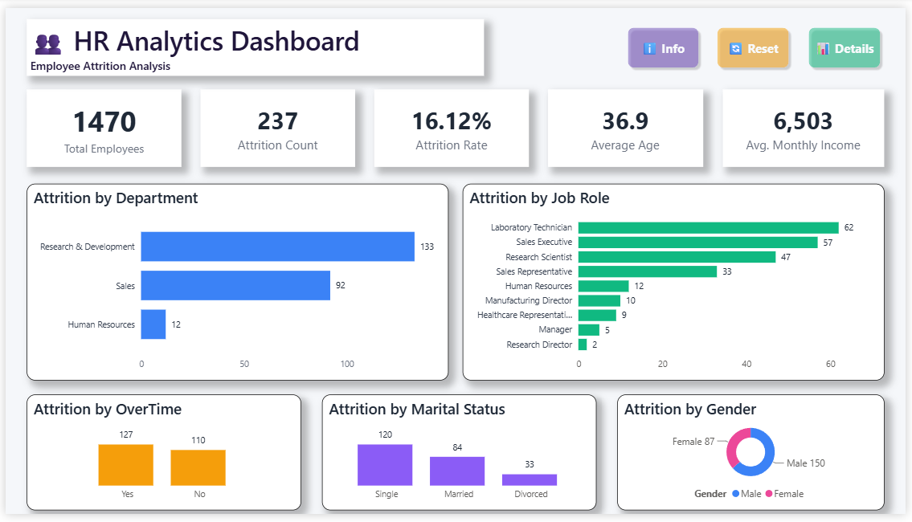
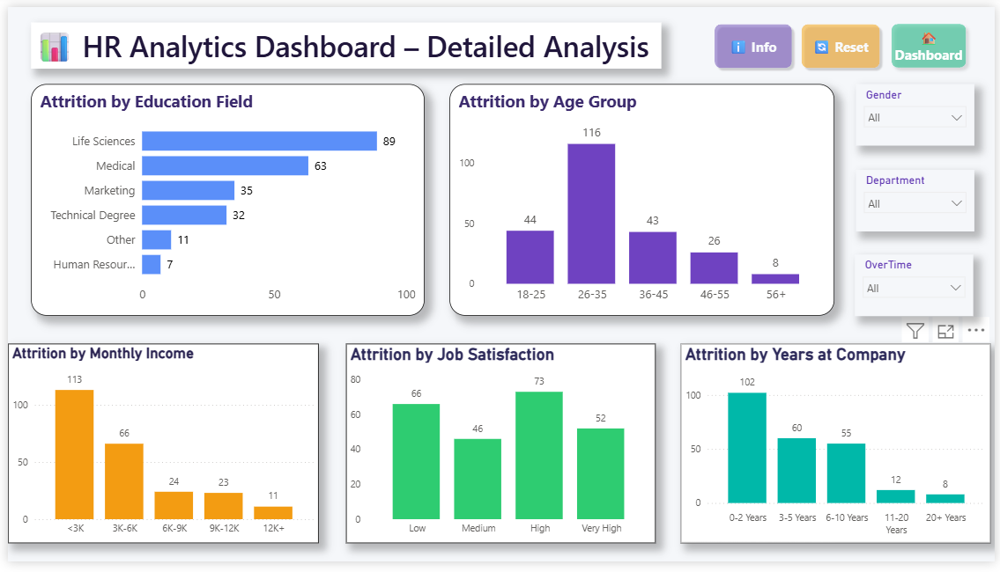
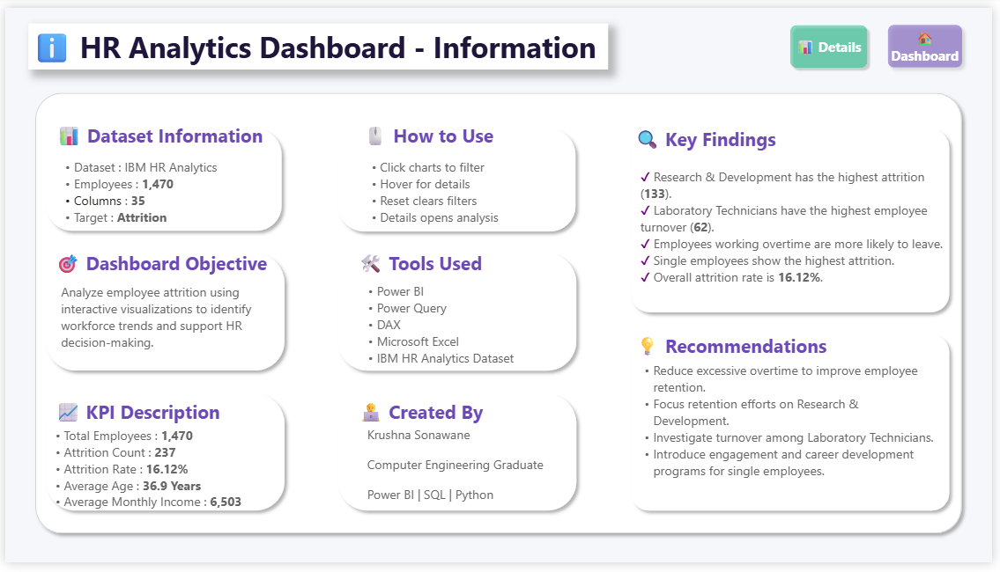

# 📈 HR Analytics Dashboard | Employee Attrition Analysis 

A professional and interactive **HR Analytics Dashboard** built using the IBM HR Analytics Employee Attrition dataset. This project analyzes employee attrition trends and provides actionable insights using Power BI, SQL, Python, DAX, and Power Query.

---

## 📌 Project Overview

Employee attrition is a major challenge for organizations. This dashboard helps HR professionals identify the factors contributing to employee turnover and supports data-driven decision making.

The dashboard includes:

- Executive KPI Overview
- Employee Attrition Analysis
- Department-wise Analysis
- Job Role Analysis
- Gender Analysis
- Overtime Analysis
- Education Field Analysis
- Age Group Analysis
- Monthly Income Analysis
- Job Satisfaction Analysis
- Years at Company Analysis

---

## 🛠️ Tools & Technologies

- Power BI
- Power Query
- DAX
- SQL
- Python
- Microsoft Excel

---

## 📂 Project Structure

```
HR-Analytics-Dashboard/
│
├── Dataset/
│   ├── IBM_HR_Analytics_Original.csv
│   └── IBM_HR_Analytics_Cleaned.csv
│
├── Images/
│   ├── Dashboard.png
│   ├── Detailed_Analysis.png
│   └── Information.png
│
├── SQL/
│   └── hr_analytics_sql.sql
│
├── Python/
│   └── HR_Analysis.ipynb
│
├── DAX/
│   └── DAX_Measures.md
│
├── Power Query/
│   └── Power_Query_Steps.md
│
├── HR_Analytics_Dashboard.pbix
├── README.md
└── LICENSE
```

---

## 📊 Dashboard Pages

### Dashboard
Executive summary showing:
- Total Employees
- Attrition Count
- Attrition Rate
- Average Age
- Average Monthly Income

### Detailed Analysis
Includes analysis by:
- Education Field
- Age Group
- Monthly Income
- Job Satisfaction
- Years at Company

### Information Page
Contains:
- Dataset Information
- Dashboard Objective
- KPI Description
- Key Findings
- Recommendations
- Tools Used

---

## 📈 Key Insights

- Research & Development department has the highest attrition.
- Laboratory Technicians experience the highest employee turnover.
- Employees working overtime are more likely to leave.
- Single employees have the highest attrition rate.
- Employees aged 26–35 show the highest attrition.
- Employees earning below ₹3K monthly have the highest attrition.

---

## 📷 Dashboard Preview

### Dashboard



### Detailed Analysis



### Information Page



---

## 🚀 Future Improvements

- Predict employee attrition using Machine Learning.
- Publish dashboard to Power BI Service.
- Add drill-through reports.
- Add forecasting and trend analysis.

---

## 👨‍💻 Author

**Krushna Sonawane**

- Power BI
- SQL
- Python
- Data Analytics
